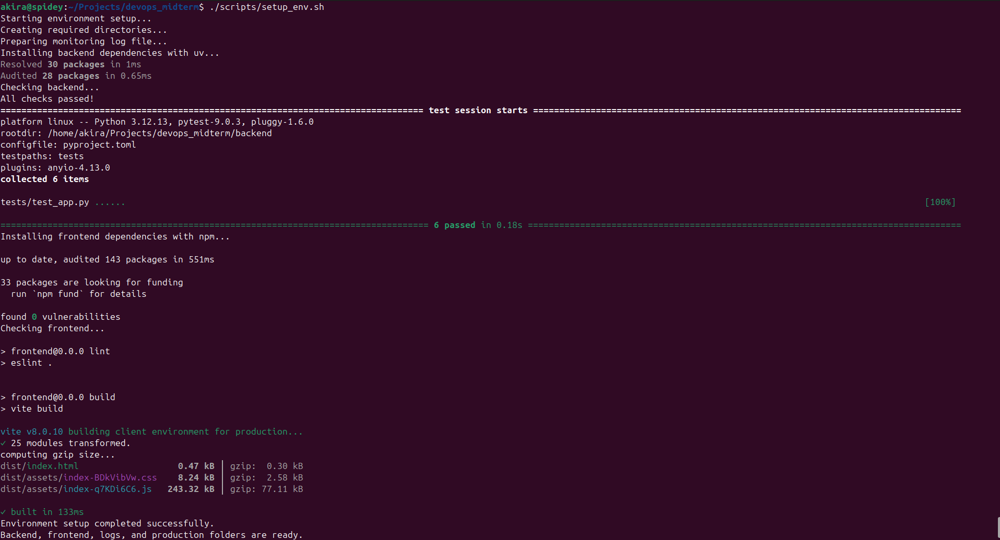
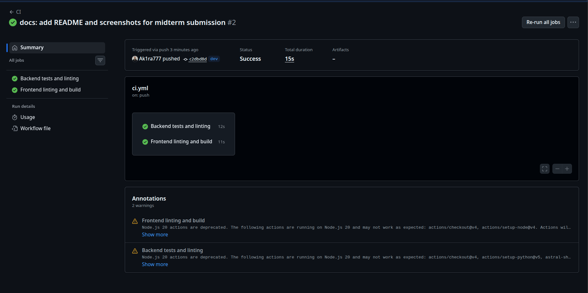
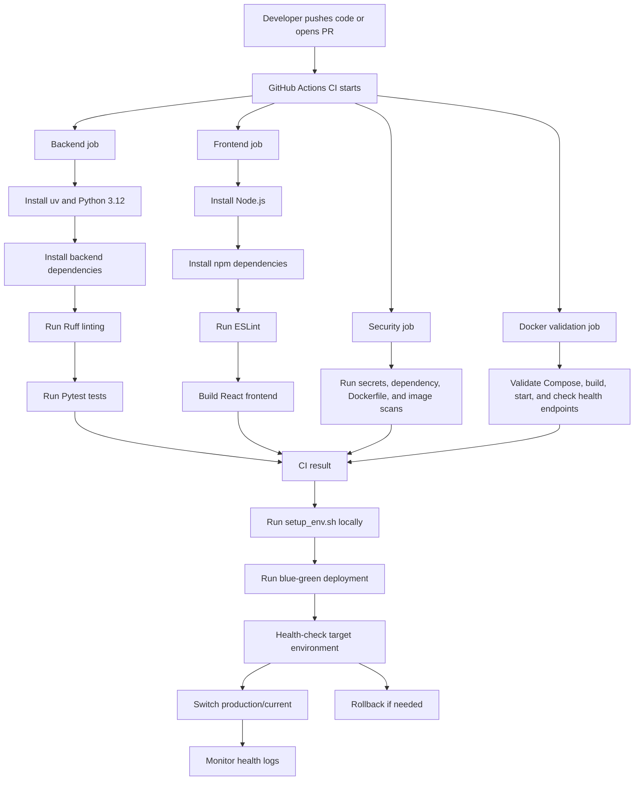
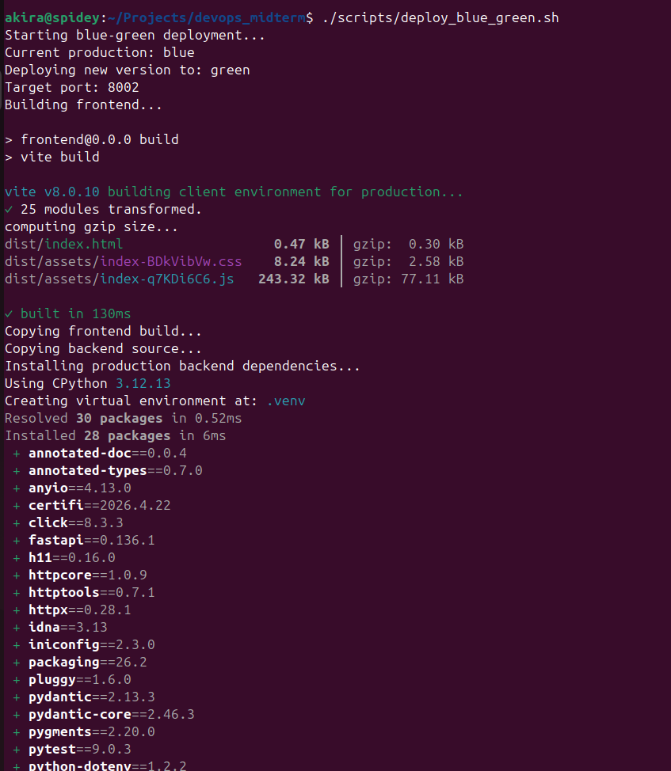
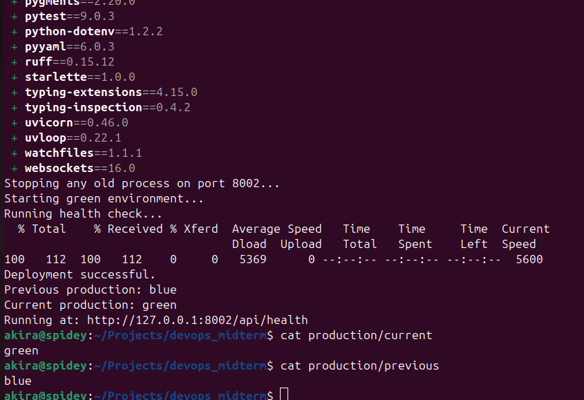
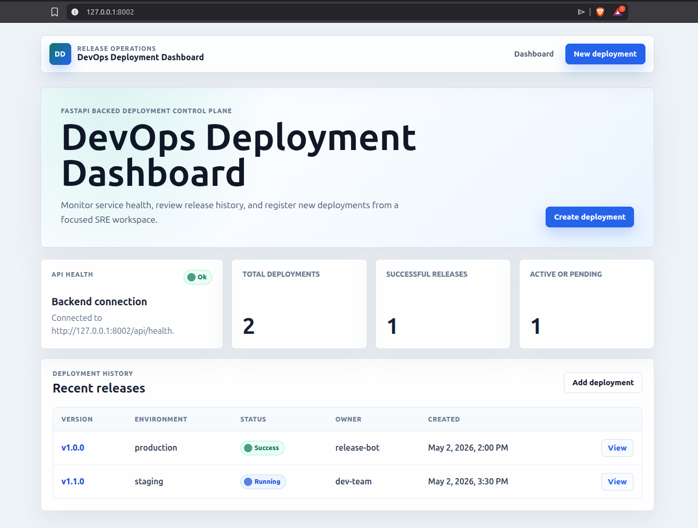
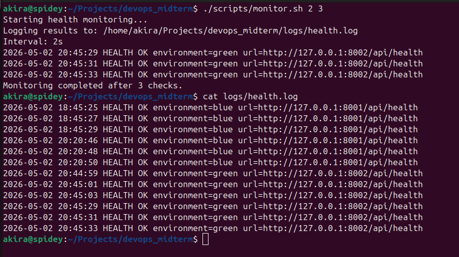

Davit Meshvelashvili

# DevOps Midterm Project — Deployment Dashboard

This repository contains a small full-stack DevOps project built for the DevOps midterm assignment.

The project demonstrates a complete development and deployment workflow:

- React + Vite frontend
- FastAPI backend
- Automated tests
- Code linting
- GitHub Actions CI
- One-command environment setup
- Local blue-green deployment simulation
- Rollback mechanism
- Health check monitoring with log output

---


## Tech Stack

| Area | Tool |
|---|---|
| Frontend | React + Vite |
| Backend | FastAPI |
| Backend package manager | uv |
| Frontend package manager | npm |
| Backend testing | Pytest |
| Backend linting | Ruff |
| Frontend linting | ESLint |
| CI | GitHub Actions |
| IaC / Automation | Bash scripts |
| Local CD | Blue-green deployment simulation |
| Monitoring | Bash + curl health checks |
| Version control | Git + GitHub |

---

## Project Structure

```text
devops_midterm/
├── backend/
│   ├── main.py
│   ├── pyproject.toml
│   ├── uv.lock
│   └── tests/
│       └── test_app.py
├── frontend/
│   ├── package.json
│   ├── package-lock.json
│   ├── vite.config.js
│   ├── index.html
│   └── src/
│       ├── App.jsx
│       ├── App.css
│       ├── index.css
│       └── main.jsx
├── scripts/
│   ├── setup_env.sh
│   ├── deploy_blue_green.sh
│   ├── rollback.sh
│   └── monitor.sh
├── .github/
│   └── workflows/
│       └── ci.yml
├── docs/
│   └── screenshots/
├── .gitignore
└── README.md
```

Generated runtime folders such as `production/`, `logs/`, `frontend/dist/`, and `node_modules/` are ignored by Git.

---

## Prerequisites

Before running the project, the following tools should be installed:

```text
Git
Python 3.12
uv
Node.js
npm
curl
lsof
```

The setup script prepares the project environment, installs project dependencies, creates local runtime folders, and runs checks.

---

## Web Application Features

The application is a **DevOps Deployment Dashboard**.

It supports:

- Viewing backend health status
- Viewing deployment history
- Opening deployment details by version
- Creating a new deployment through a form
- Running as a local production app through blue-green deployment

### Frontend Routes

| Route | Purpose |
|---|---|
| `/` | Dashboard page |
| `/deployments/:version` | Dynamic deployment details page |
| `/new-deployment` | Form page for creating a deployment |

### Backend API Endpoints

| Method | Endpoint | Purpose |
|---|---|---|
| `GET` | `/api/health` | Health check endpoint |
| `GET` | `/api/ready` | Readiness check endpoint |
| `GET` | `/api/deployments` | List deployments |
| `GET` | `/api/deployments/{version}` | Dynamic deployment route |
| `POST` | `/api/deployments` | Input endpoint for creating a deployment |

This satisfies the web application requirement because the project includes a dynamic route, an input form/endpoint, and automated unit tests.

---

## Git Branch Strategy

The project uses two active branches:

```text
main
dev
```

Development workflow:

```text
1. Work on dev
2. Push dev
3. Open pull request from dev to main
4. GitHub Actions runs CI
5. Merge only after CI passes
```

The project uses clean, descriptive commit messages such as:

```text
feat: add FastAPI backend with deployment API tests
feat: build React deployment dashboard
ci: add GitHub Actions workflow for tests and linting
chore: add automated environment setup script
feat: add local blue-green deployment script
feat: add rollback script
feat: add health monitoring script
docs: add project README and screenshots
```

---

## Local Development Setup

### 1. Clone the repository

```bash
git clone https://github.com/Ak1ra777/devops_midterm
cd devops_midterm
```

### 2. Run automated environment setup

The project includes a one-command environment setup script:

```bash
./scripts/setup_env.sh
```

This script:

- Creates required runtime directories
- Prepares the logs folder
- Prepares local production folders
- Installs backend dependencies using `uv`
- Runs backend linting
- Runs backend tests
- Installs frontend dependencies using `npm`
- Runs frontend linting
- Builds the frontend

This satisfies the IaC / automation requirement because environment preparation is automated through a single command.

### Successful IaC Execution



---

## Running the App in Development Mode

Development mode uses two terminals.

### Terminal 1 — Backend

```bash
cd backend
uv run uvicorn main:app --reload
```

Backend runs at:

```text
http://127.0.0.1:8000
```

Useful backend URLs:

```text
http://127.0.0.1:8000/api/health
http://127.0.0.1:8000/api/deployments
http://127.0.0.1:8000/docs
```

### Terminal 2 — Frontend

```bash
cd frontend
npm run dev
```

Frontend runs at:

```text
http://localhost:5173
```

In development mode, the React frontend calls the FastAPI backend at `http://127.0.0.1:8000`.

---

## Running Tests and Linting Locally

### Backend

```bash
cd backend
uv run ruff check .
uv run pytest
```

### Frontend

```bash
cd frontend
npm run lint
npm run build
```

---

## Continuous Integration

The project uses GitHub Actions.

Workflow file:

```text
.github/workflows/ci.yml
```

The pipeline runs automatically on:

```yaml
push:
pull_request:
```

The CI pipeline has four jobs.

### Backend Job

The backend job:

1. Checks out the repository
2. Installs `uv`
3. Sets up Python 3.12
4. Installs backend dependencies
5. Runs Ruff linting
6. Runs Pytest tests

### Frontend Job

The frontend job:

1. Checks out the repository
2. Sets up Node.js
3. Installs frontend dependencies
4. Runs ESLint
5. Builds the React app

### Security Job

The security job runs Gitleaks secrets scanning, frontend `npm audit`, backend `pip-audit`, Dockerfile linting, and Trivy image vulnerability scans.

### Docker Validation Job

The Docker validation job checks Docker Compose syntax, builds the stack, starts it, waits for container health checks, verifies backend/frontend health endpoints, and checks Prometheus and Loki readiness.

This satisfies the CI requirement because every push and pull request automatically runs tests, linting, security scans, Docker Compose validation, and post-start health checks.

### Successful CI Pipeline



---

## CI/CD Workflow Diagram



---

## Infrastructure as Code / Automation

Script:

```text
scripts/setup_env.sh
```

Run:

```bash
./scripts/setup_env.sh
```

What it does:

```text
1. Moves to the project root
2. Creates logs and production folders
3. Creates the health log file
4. Installs backend dependencies
5. Runs backend linting and tests
6. Installs frontend dependencies
7. Runs frontend linting and build
```

This script automates environment preparation and can be executed with one command.

---

## Local Blue-Green Deployment

The project simulates blue-green deployment locally.

Two production-like environments are used:

| Environment | Port |
|---|---|
| Blue | `8001` |
| Green | `8002` |

The active environment is stored in:

```text
production/current
```

The previous environment is stored in:

```text
production/previous
```

In a real production system, a load balancer or reverse proxy would route users to blue or green. In this local simulation, the `production/current` file represents that routing decision.

### Run Deployment

```bash
./scripts/deploy_blue_green.sh
```

Deployment behavior:

```text
1. Read current production color
2. Choose the inactive color as the target
3. Build the React frontend
4. Copy backend and frontend build into the target production folder
5. Start the target environment on its port
6. Run health check
7. If health check passes, update production/current
8. Save the old environment in production/previous
```

Example:

```text
Current production: blue
Deploying new version to: green
Target port: 8002
Running health check...
Deployment successful.
Previous production: blue
Current production: green
```

If current production is blue, open:

```text
http://127.0.0.1:8001
```

If current production is green, open:

```text
http://127.0.0.1:8002
```

### Deployment Process





### Running App



---

## Rollback Mechanism

The project includes a rollback script:

```text
scripts/rollback.sh
```

Run:

```bash
./scripts/rollback.sh
```

Rollback behavior:

```text
1. Read production/current
2. Read production/previous
3. Health-check the previous environment
4. Switch current back to previous
5. Store the old current as previous
```

Example:

```text
Current production: green
Rolling back to: blue
Checking rollback target health...
Rollback successful.
Current production is now: blue
Previous production is now: green
```

This satisfies the rollback requirement because the project can revert from one local production environment to the previous one.

---

## Monitoring and Health Check

The project includes a monitoring script:

```text
scripts/monitor.sh
```

Run a short demo:

```bash
./scripts/monitor.sh 2 3
```

This means:

```text
Check every 2 seconds
Stop after 3 checks
```

Run continuously:

```bash
./scripts/monitor.sh
```

The script:

```text
1. Reads production/current
2. Chooses the correct production port
3. Calls /api/health
4. Appends the result to logs/health.log
```

Example log output:

```text
2026-05-02 20:45:29 HEALTH OK environment=green url=http://127.0.0.1:8002/api/health
2026-05-02 20:45:31 HEALTH OK environment=green url=http://127.0.0.1:8002/api/health
2026-05-02 20:45:33 HEALTH OK environment=green url=http://127.0.0.1:8002/api/health
```

### Monitoring Logs



---

## Stopping Local Production Processes

The deployment script starts blue and green environments in the background.

To stop blue:

```bash
kill -9 $(lsof -ti :8001)
```

To stop green:

```bash
kill -9 $(lsof -ti :8002)
```

Safe version:

```bash
if lsof -ti :8001 > /dev/null; then kill -9 $(lsof -ti :8001); fi
if lsof -ti :8002 > /dev/null; then kill -9 $(lsof -ti :8002); fi
```

---
