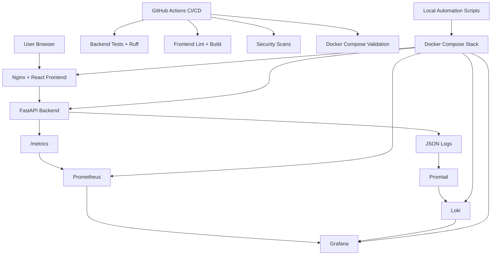

# DevOps Final Project - Deployment Dashboard

This repository contains a full-stack DevOps final project: a React/Vite deployment dashboard backed by a FastAPI API and improved with Docker Compose, CI/CD automation, monitoring, logging, alerting, security scans, local automation scripts, and reliability runbooks.

The project runs fully on a local machine with Docker Compose. No paid cloud services, API keys, or external accounts are required for the local runtime.

Repository: `https://github.com/Ak1ra777/devops-final-project`

---

## Architecture

The application is split into a frontend container, a backend container, and an observability stack connected through a Docker Compose network.

| Component | Purpose |
|---|---|
| React + Vite frontend | User-facing deployment dashboard |
| Nginx frontend container | Serves the production frontend build and proxies API requests |
| FastAPI backend | Provides health, readiness, deployment, metrics, and test-error endpoints |
| Docker Compose network | Connects backend, frontend, Prometheus, Grafana, Loki, and Promtail |
| Prometheus | Scrapes backend metrics and evaluates alert rules |
| Grafana | Displays dashboards using Prometheus and Loki datasources |
| Loki | Stores application logs |
| Promtail | Ships backend JSON logs to Loki |
| GitHub Actions CI/CD | Runs tests, builds, security scans, and Docker validation |
| Local scripts | Automate local startup, validation, security scans, monitoring, and rollback |



---

## Features

- Deployment dashboard frontend built with React and Vite
- FastAPI backend API for deployment data
- Backend health check endpoint: `/api/health`
- Backend readiness endpoint: `/api/ready`
- Prometheus metrics endpoint: `/metrics`
- JSON request logs written by the backend
- Simulated error endpoint for alert testing: `/api/simulate-error`
- Docker Compose local runtime for app and observability services
- Prometheus metrics scraping and alert rules
- Grafana dashboard provisioning
- Loki log storage and Promtail log shipping
- GitHub Actions CI/CD with backend, frontend, security, and Docker validation jobs
- Local automation scripts for startup, validation, security scans, monitoring, and rollback
- Reliability documentation for rollback, incident response, and SLOs

---

## Repository Structure

```text
devops-final-project/
├── backend/
│   ├── main.py
│   ├── pyproject.toml
│   ├── uv.lock
│   ├── Dockerfile
│   └── tests/
├── frontend/
│   ├── src/
│   ├── package.json
│   ├── package-lock.json
│   ├── vite.config.js
│   ├── nginx.conf
│   └── Dockerfile
├── monitoring/
│   ├── prometheus/
│   ├── grafana/
│   ├── loki/
│   └── promtail/
├── scripts/
│   ├── run_local.sh
│   ├── validate_environment.sh
│   ├── post_deploy_check.sh
│   ├── security_scan.sh
│   ├── setup_env.sh
│   ├── deploy_blue_green.sh
│   ├── rollback.sh
│   └── monitor.sh
├── docs/
│   ├── ROLLBACK.md
│   ├── INCIDENT_RESPONSE.md
│   ├── SLO.md
│   └── screenshots/
├── .github/
│   └── workflows/
│       └── ci.yml
├── docker-compose.yml
├── .env.example
└── README.md
```

Generated runtime folders and local files such as `.env`, `logs/`, `production/`, `frontend/dist/`, and `node_modules/` are ignored by Git.

---

## Prerequisites

Install these tools before running the project:

- Git
- Docker and Docker Compose
- Python 3.12 and `uv` for non-Docker backend checks
- Node.js 22 and `npm` for non-Docker frontend checks
- `curl`

---

## One-Command Local Execution

Start the full local Docker Compose stack:

```bash
./scripts/run_local.sh
```

The script:

- Moves to the project root automatically
- Prepares the `logs/` directory
- Makes logs writable for the backend container
- Creates `.env` from `.env.example` if `.env` is missing
- Validates Docker Compose configuration
- Builds images with fresh base images using `docker compose build --pull`
- Starts services with `docker compose up -d`
- Runs `./scripts/validate_environment.sh`

Useful URLs after startup:

| Service | URL |
|---|---|
| Frontend | `http://127.0.0.1:3000` |
| Backend health | `http://127.0.0.1:8000/api/health` |
| Backend docs | `http://127.0.0.1:8000/docs` |
| Prometheus | `http://127.0.0.1:9090` |
| Grafana | `http://127.0.0.1:3001` |
| Loki | `http://127.0.0.1:3100` |

Default Grafana credentials for local use come from `.env.example`:

```text
admin / admin
```

---

## Manual Docker Compose Commands

Use these commands if you want to run the stack manually:

```bash
docker compose config
docker compose build --pull
docker compose up -d
docker compose ps
docker compose down -v --remove-orphans
```

---

## Local Validation Commands

Run these commands after startup or while debugging:

```bash
./scripts/validate_environment.sh
./scripts/post_deploy_check.sh
./scripts/security_scan.sh
./scripts/monitor.sh 2 2
```

What they do:

| Script | Purpose |
|---|---|
| `validate_environment.sh` | Checks Docker service health and readiness endpoints |
| `post_deploy_check.sh` | Runs environment validation plus backend metrics, deployments API, and Prometheus target checks |
| `security_scan.sh` | Runs local npm and Python dependency scans, plus optional local Gitleaks, Hadolint, and Trivy checks |
| `monitor.sh` | Writes repeated health check results to `logs/health.log` |

---

## Non-Docker Development Checks

Backend:

```bash
cd backend
uv sync --all-groups
uv run ruff check .
uv run pytest
```

Frontend:

```bash
cd frontend
npm ci
npm run lint
npm run build
```

The original local setup script is still available:

```bash
./scripts/setup_env.sh
```

---

## CI/CD Workflow

GitHub Actions workflow:

```text
.github/workflows/ci.yml
```

The workflow runs on push and pull request and contains four jobs:

| Job | What it does |
|---|---|
| Backend tests and linting | Installs backend dependencies with `uv`, runs Ruff, and runs Pytest |
| Frontend linting and build | Installs frontend dependencies with `npm ci`, runs ESLint, and builds the frontend |
| Security scans | Runs secrets, dependency, Dockerfile, and image security scans |
| Docker Compose validation | Validates Compose, builds images, starts the stack, waits for health, checks endpoints, and cleans up |

Security tools used in CI:

- Gitleaks for secrets scanning
- `npm audit` for frontend dependency vulnerabilities
- `pip-audit` for backend dependency vulnerabilities
- Hadolint for Dockerfile linting
- Trivy for Docker image vulnerability scanning

The Docker validation job checks:

- `docker compose config`
- `docker compose build --pull`
- `docker compose up -d`
- Backend health: `http://127.0.0.1:8000/api/health`
- Frontend health: `http://127.0.0.1:3000/health`
- Prometheus readiness: `http://127.0.0.1:9090/-/ready`
- Loki readiness: `http://127.0.0.1:3100/ready`
- Cleanup with `docker compose down -v --remove-orphans`

---

## Security Implementation

The project includes practical free security automation suitable for local development and GitHub Actions.

Implemented security controls:

- Dependency vulnerability scanning for frontend packages with `npm audit`
- Dependency vulnerability scanning for backend packages with `pip-audit`
- Container image vulnerability scanning with Trivy
- Dockerfile linting with Hadolint
- Secrets scanning with Gitleaks
- No real secrets committed to the repository
- `.env.example` is used for local configuration defaults
- `.env` is ignored by Git
- Backend and frontend containers use `security_opt: ["no-new-privileges:true"]`
- Docker images are built with `--pull` in CI and local automation to avoid stale vulnerable base layers

Local security scan:

```bash
./scripts/security_scan.sh
```

Optional local tools such as Gitleaks, Hadolint, and Trivy are skipped with warnings if they are not installed locally. CI still keeps those checks blocking.

---

## Monitoring, Logging, Observability, and Alerting

The backend exposes Prometheus metrics at:

```text
http://127.0.0.1:8000/metrics
```

Important metrics include:

- `app_requests_total`
- `app_errors_total`
- `app_request_duration_seconds`

Prometheus scrapes the backend using the `fastapi-backend` scrape job. Grafana is provisioned with Prometheus and Loki datasources. The backend writes JSON request logs to `logs/backend.log`, Promtail reads those logs, and Loki stores them for querying through Grafana.

Alert rules are defined in:

```text
monitoring/prometheus/alert_rules.yml
```

Current alerts:

| Alert | Purpose |
|---|---|
| `BackendDown` | Fires when Prometheus cannot scrape the backend |
| `HighErrorRate` | Fires when backend server errors exceed the configured threshold |
| `HighRequestLatency` | Fires when backend p95 latency is above the configured threshold |

The backend includes `/api/simulate-error` so error metrics and alert behavior can be tested intentionally.

---

## Reliability Improvements

Reliability features:

- Docker health checks for backend, frontend, Prometheus, Grafana, and Loki
- `restart: unless-stopped` policies in Docker Compose
- `./scripts/validate_environment.sh` for service and endpoint validation
- `./scripts/post_deploy_check.sh` for post-start checks
- `./scripts/monitor.sh` for repeated health monitoring with log output
- `./scripts/rollback.sh` for local blue-green rollback
- Reliability runbooks and SLO documentation

Reliability docs:

- [Rollback runbook](docs/ROLLBACK.md)
- [Incident response runbook](docs/INCIDENT_RESPONSE.md)
- [Service level objectives](docs/SLO.md)

The local blue-green deployment simulation remains available:

```bash
./scripts/deploy_blue_green.sh
./scripts/rollback.sh
```

---

## Screenshots Checklist

Existing screenshots are kept under `docs/screenshots/`. Additional final-project screenshots can be added there before submission.

| Screenshot | Path | Status |
|---|---|---|
| CI successful | `docs/screenshots/ci-success.png` | Existing |
| Frontend dashboard / running app | `docs/screenshots/running-app.png` | Existing |
| Local setup script passing | `docs/screenshots/iac-setup.png` | Existing |
| Blue-green deployment process | `docs/screenshots/deployment-process-1.png` | Existing |
| Blue-green deployment process | `docs/screenshots/deployment-process-2.png` | Existing |
| Monitoring logs | `docs/screenshots/monitoring-logs.png` | Existing |
| Security scans successful | `docs/screenshots/security-scans-success.png` | Placeholder needed |
| Docker validation successful | `docs/screenshots/docker-validation-success.png` | Placeholder needed |
| `docker compose ps` healthy services | `docs/screenshots/docker-compose-healthy.png` | Placeholder needed |
| Backend health endpoint | `docs/screenshots/backend-health.png` | Placeholder needed |
| Prometheus targets | `docs/screenshots/prometheus-targets.png` | Placeholder needed |
| Prometheus alerts | `docs/screenshots/prometheus-alerts.png` | Placeholder needed |
| Grafana dashboard | `docs/screenshots/grafana-dashboard.png` | Placeholder needed |
| Loki logs | `docs/screenshots/loki-logs.png` | Placeholder needed |
| Local scripts passing | `docs/screenshots/local-scripts-passing.png` | Placeholder needed |
| Reliability docs or runbook | `docs/screenshots/reliability-runbooks.png` | Placeholder optional |

Placeholder rows are documentation targets only; add the image files when those screenshots are captured.

---

## Submission Notes

- GitHub repository: `https://github.com/Ak1ra777/devops-final-project`
- The project is documented in this README.
- The full application and observability stack run locally with Docker Compose.
- CI/CD, security scanning, Docker validation, local automation, monitoring, alerting, and reliability documentation are included.
- No paid cloud services are required.

